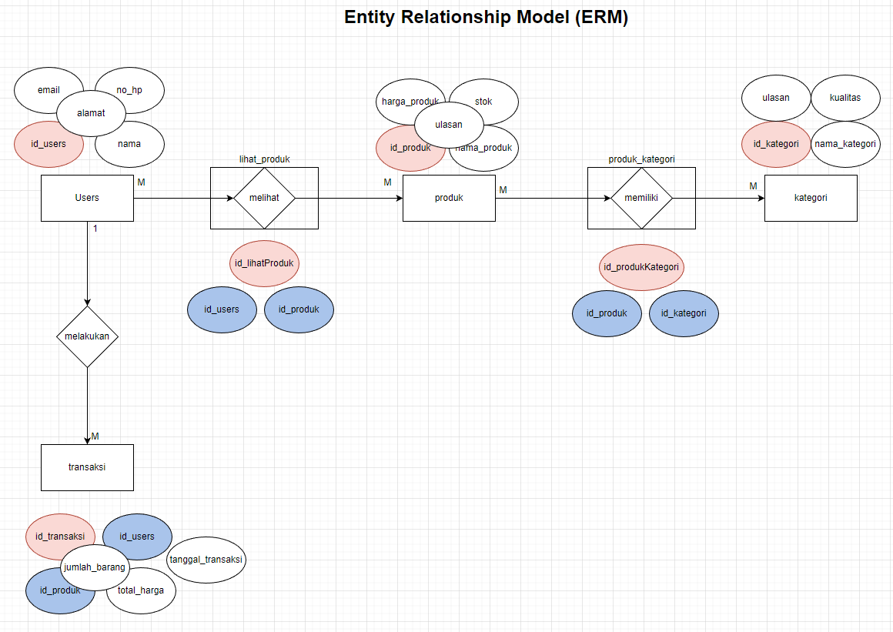
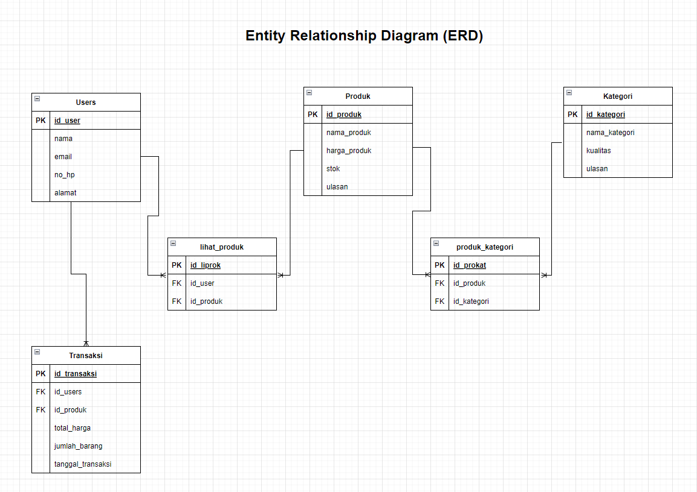

# TPA 04 - ONLINE RETAIL DATABASE

## Entity Relationship Model (ERM) 
 

## Entitiy Relationship Diagram (ERD)
 

### **Langkah - Langkah Pembuatan TPA - 04** 
 

**Perintah DDL**
1. [Membuat Database](./DDL/create-database.sql)
2. [Membuat Tabel](./DDL/create-table.sql)
3. [Menghapus Database](./DDL/delete-database.sql)
4. [Menghapus Tabel](./DDL/delete-table.sql)

**Perintah DML**

1. [Memasukan Data Pada Tabel](./DML/insert-data-table.sql)
2. [Update Data Pada Tabel](./DML/update-data.sql)
3. [Menampilkan Data Tabel](./DML/get-data.sql)
4. [Menghapus Isi Data Tabel](./DML/delete-data-table.sql)

**Kasus - Kasus Query Pada Soal**

1. [Soal Nomer 1](./SOAL/kasus-01.sql)
2. [Soal Nomer 2](./SOAL/kasus-02.sql)
3. [Soal Nomer 3](./SOAL/kasus-03.sql)
4. [Soal Nomer 4](./SOAL/kasus-04.sql)